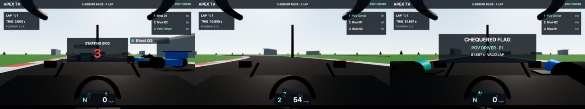

# APEX TV

A browser-based multiplayer racing game built with Three.js and Node.js.
Drive a procedural circuit with cockpit, hood, or chase cameras, engine audio,
lap timing, and a live leaderboard.

## Run locally

Requires Node.js 20 or newer.

```bash
npm ci
npm start
```

Open [localhost:3000](http://localhost:3000). Enter the grid in another tab or
visit `http://<your-ip>:3000` from another computer to join a practice room.

`npm start` builds the client before starting the server. After editing client
files, run `npm run build` and reload the browser.

## Controls

| Key | Action |
| --- | --- |
| W / ↑ | Accelerate |
| S / ↓ | Brake, then reverse |
| A / D or ← / → | Steer |
| Space | Handbrake |
| C | Cycle cockpit → hood → chase |
| R | Return to the track |
| M | Mute / unmute |

## Racing and multiplayer

- Practice rooms hold up to 16 drivers by default. Menu screens do not occupy a slot.
- Timing starts when you cross the start line forward. Complete the circuit in order to set a lap.
- Leaving the track, respawning, reversing through checkpoints, or pausing the tab invalidates the timed lap. Cross the start line again to begin a fresh attempt.
- Lost connections reconnect automatically into a fresh session, which may be in another room.
- Physics runs locally at 60 fixed steps per second. The server validates state and lap progress, then sends room snapshots at 20 Hz.

This is a practice prototype: car collisions, competitive server-owned physics,
and touch/gamepad controls are not implemented. Use a keyboard to drive.

## Checks

```bash
npm run build
npm test                        # Physics, input, protocol, and server tests
npx playwright install          # Install browser binaries once
npm run test:e2e                 # Chromium, Firefox, and WebKit checks
npm run test:soak                # 60 local clients for two minutes
```

GitHub Actions runs the build and test suites on Node.js 22. Open `/#debug` for
frame timing and renderer resource counts; `/healthz` reports server health,
room counts, memory, and socket queues.

## Configuration and deployment

| Variable | Default | Purpose |
| --- | --- | --- |
| `PORT` | `3000` | HTTP and WebSocket port |
| `ROOM_CAPACITY` | `16` | Drivers per room, from 1 to 32 |

For deployment, run `npm ci --include=dev && npm run build`, then
`node server.js`. A multi-stage `Dockerfile` and a Render blueprint are included.
Rooms are held in one server process; multiple replicas need shared room routing.

The client bundles pinned dependencies into hashed assets in `dist/`, with no
runtime CDN imports. Room capacity is configurable; benchmark your hosting
environment before increasing it.

## Project layout

```text
server.js             Static hosting, rooms, validation, and snapshots
public/js/            Rendering, shared circuit/physics, input, audio, and networking
public/css/           Start screen and HUD styles
public/audio/         Engine samples
scripts/              Build, load tests, and race recording tools
tests/                Unit, integration, and browser tests
recordings/           Gameplay video and preview
```

## Credits

Code: MIT. Library and asset licenses are listed in [CREDITS.md](CREDITS.md).
This project is not affiliated with Formula 1, the FIA, or F1 TV.

## Gameplay video

Three simulated clients, one cockpit view, from countdown to the finish.
**1:34 · 720p · 30 FPS · engine audio**. Click the preview to open the video.

To record another race, run `node scripts/record-race.mjs`, open
[127.0.0.1:3200](http://127.0.0.1:3200), and select **ENTER THE GRID**.
The recording harness uses three independent WebSocket clients with automated
controls and separate racing lines. It saves a WebM capture and race results in
`recordings/`; normal gameplay is unchanged.

[](recordings/three-client-race.mp4)

[▶ Watch the full race (MP4)](recordings/three-client-race.mp4)
